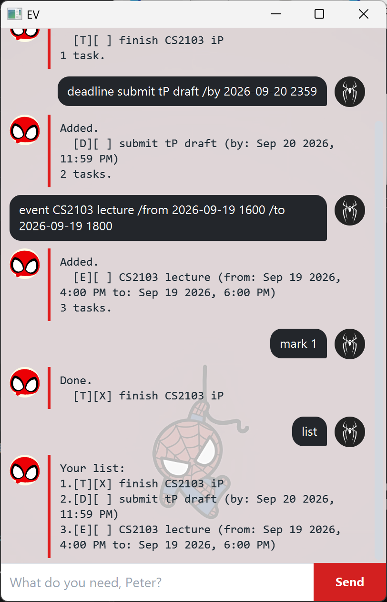

# EV User Guide

EV is a task tracker you talk to. Type a line, press Enter, and it keeps your todos,
deadlines and events for you — saved automatically, so they are still there tomorrow.



## Getting started

1. Make sure you have **Java 25** installed.
2. Download `ev.jar` from the [latest release](https://github.com/Dai-yangjie/ip/releases).
3. Put it in a folder of its own, open a command window there, and run:

   ```
   java -jar "ev.jar"
   ```

EV creates a `data` folder beside the JAR for your tasks. Nothing else is needed.

## The three kinds of task

| Icon | Kind | What it is for |
| --- | --- | --- |
| `[T]` | Todo | Something to do, with no date attached |
| `[D]` | Deadline | Something due at a particular time |
| `[E]` | Event | Something that runs from one time to another |

A `[X]` next to the icon means the task is done, and `[ ]` means it is not.

## Writing dates

Wherever EV asks for a date you may write it in any of these forms, and the time is
always optional:

```
2019-12-02        2019-12-02 1800
2/12/2019         2/12/2019 1800
```

EV reads `1800` as 6pm and shows it back as `Dec 2 2019, 6:00 PM`. A day the calendar
does not have, such as `2019-02-30`, is refused rather than quietly shifted.

## Commands

### Adding a todo — `todo`

```
todo read book
```

```
Added.
  [T][ ] read book
1 task.
```

### Adding a deadline — `deadline`

Format: `deadline DESCRIPTION /by DATE`

```
deadline return book /by 2019-12-02 1800
```

```
Added.
  [D][ ] return book (by: Dec 2 2019, 6:00 PM)
2 tasks.
```

### Adding an event — `event`

Format: `event DESCRIPTION /from DATE /to DATE`

```
event camp /from 2019-12-01 0900 /to 2019-12-03 1700
```

```
Added.
  [E][ ] camp (from: Dec 1 2019, 9:00 AM to: Dec 3 2019, 5:00 PM)
3 tasks.
```

An event may not end before it starts.

### Listing everything — `list`

```
list
```

```
Your list:
1.[T][ ] read book
2.[D][ ] return book (by: Dec 2 2019, 6:00 PM)
3.[E][ ] camp (from: Dec 1 2019, 9:00 AM to: Dec 3 2019, 5:00 PM)
```

The number in front of each task is how you refer to it in every other command.

### Marking a task — `mark`, `unmark`

Format: `mark NUMBER` / `unmark NUMBER`

```
mark 1
```

```
Done.
  [T][X] read book
```

### Removing a task — `delete`

Format: `delete NUMBER`

```
delete 2
```

```
Removed.
  [D][ ] return book (by: Dec 2 2019, 6:00 PM)
2 tasks.
```

### Changing one detail — `update`

Format: `update NUMBER OPTION VALUE`, where the option is one of:

| Option | Changes | Works on |
| --- | --- | --- |
| `/desc` | the description | every task |
| `/by` | the due time | deadlines |
| `/from` | the start | events |
| `/to` | the end | events |

```
update 2 /by 2019-12-05 1800
```

```
Updated.
  [D][ ] return book (by: Dec 5 2019, 6:00 PM)
```

Only one detail changes at a time, and everything else about the task — including
whether it is done — stays as it was.

### Finding tasks — `find`

Format: `find TEXT`

```
find book
```

```
Matches:
1.[T][X] read book
2.[D][ ] return book (by: Dec 5 2019, 6:00 PM)
```

The search ignores capitalisation and matches part of a word, so `boo` finds `book`.
Matching tasks keep the number they have in the full list, so you can mark or delete one
straight away.

### Seeing one day — `on`

Format: `on DATE`

```
on 2019-12-02
```

```
On Dec 2 2019:
2.[D][ ] return book (by: Dec 2 2019, 6:00 PM)
3.[E][ ] camp (from: Dec 1 2019, 9:00 AM to: Dec 3 2019, 5:00 PM)
```

Deadlines due that day and events running over it are shown. Todos have no date, so they
never appear here.

### Leaving — `bye`

```
bye
```

EV says goodbye and the window closes a moment later. Your tasks are already saved.

## Saving

Every change is written to `data/ev.txt` straight away, so there is no save command and
nothing to lose if the app is closed. The file is plain text, one task per line, and you
may edit it by hand if you like. If a line is damaged, EV tells you how many lines it had
to skip and keeps the rest.

Because the folder is found relative to where you run EV from, keep the JAR in its own
folder and start it from there.

## When something goes wrong

EV never guesses. If a command cannot be carried out, nothing changes and it says what it
needs instead:

```
deadline pay rent /by tomorrow
```

```
Not a date: "tomorrow"
Use 2019-12-02, 2019-12-02 1800, 2/12/2019 or 2/12/2019 1800.
```

Two limits worth knowing:

- A description cannot contain `|`, because that is how tasks are separated in the save
  file.
- The same task cannot be added twice. EV tells you which number it already has.

## Command summary

| Command | Format |
| --- | --- |
| Add a todo | `todo DESCRIPTION` |
| Add a deadline | `deadline DESCRIPTION /by DATE` |
| Add an event | `event DESCRIPTION /from DATE /to DATE` |
| List everything | `list` |
| Mark as done | `mark NUMBER` |
| Mark as not done | `unmark NUMBER` |
| Delete | `delete NUMBER` |
| Change one detail | `update NUMBER /desc\|/by\|/from\|/to VALUE` |
| Search | `find TEXT` |
| See one day | `on DATE` |
| Exit | `bye` |
